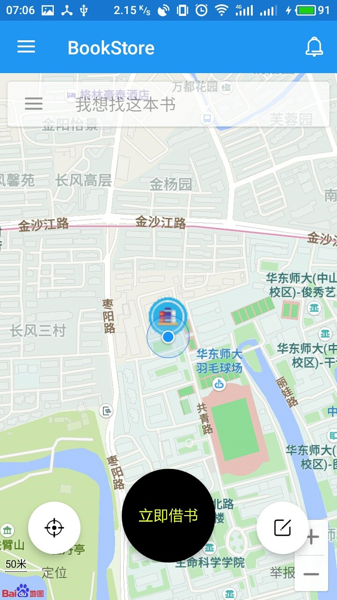
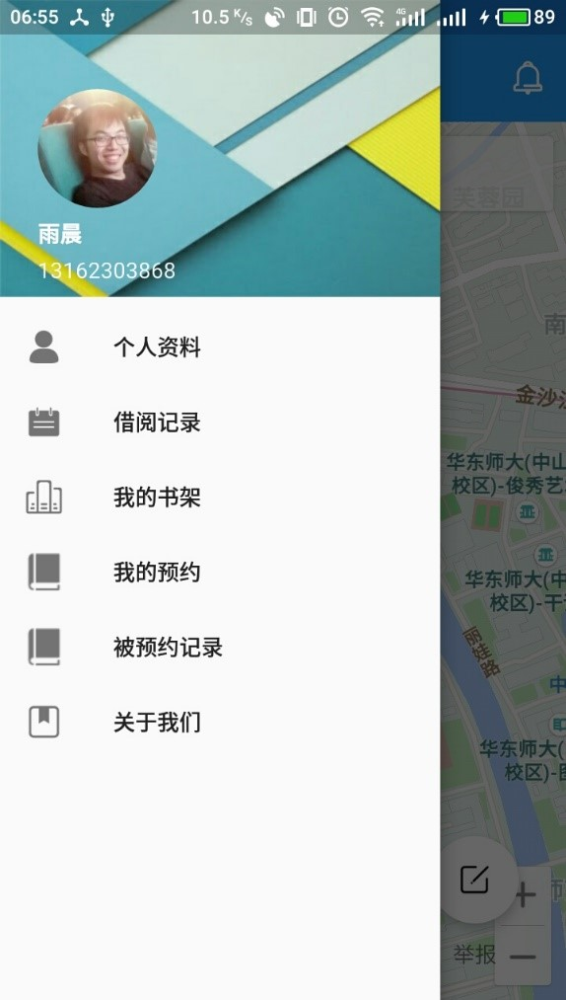
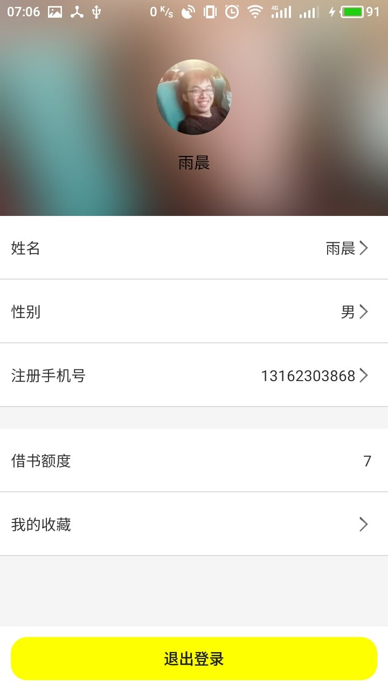
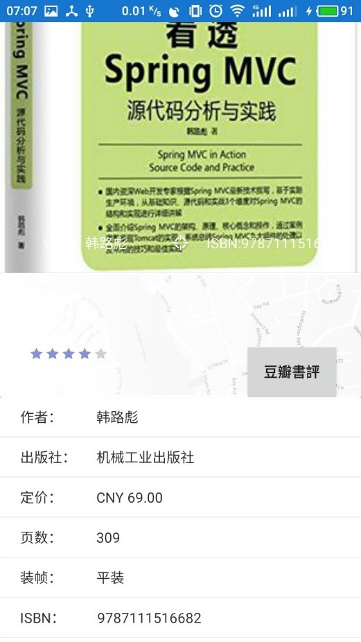
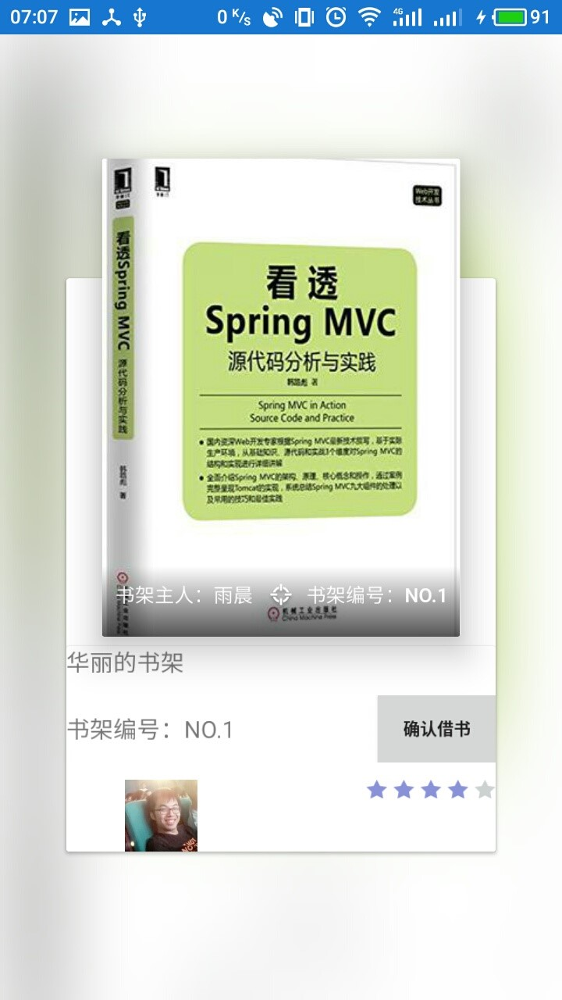
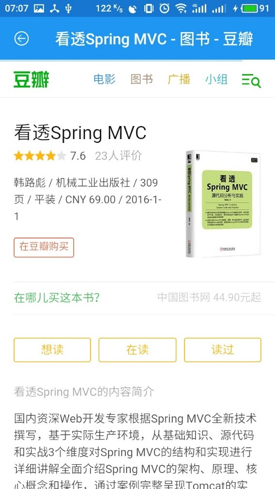

# Mobile Bookstore （MORE移动书屋）

------

> **版权所有，仅供学习参考，禁止他用！**
>
> All Rights Reserved.
>
> 如有其他需求请联系：920901835@qq.com

## 项目说明：

​	基于目前纸质书籍重用率低，书籍购买成本高，废弃书籍空间占用率高等现状，结合时下热门的共享单车模式及互联网+的理念，打造一款移动端的流动书屋系统，用户可以简单的通过扫码完成换书操作，便捷获得所需的书籍，同时加入社交元素，满足多样化的社交需求，通过网络驱动提升书籍重用率和利用率。

​       人们可以随时在路口、学校等各个地方的移动书柜里面借书，并等读完后在任意的一个书柜里面还书，想读就读，还书也相当轻松，打破传统的“哪里借哪里还”的借书规矩。而且，每个移动书柜的书的种类都会随着人们的借与还而发生变化，每浏览一个移动书柜，都是一次带来惊喜的旅程。

​       同时，用户还可以拥有一个自己的移动书柜，在其中添置一些所不必要的书，只需打开app轻松一扫录入系统，就能够让其他用户得到相应的讯息，在让书籍发挥价值的同时，说不定能让你与他/她来一次完美的邂逅呢？

------

## Function：

### **项目运营方式：**

​	初期以用户自行搭建书架录入书籍为书籍主要来源，使得整个流程得以运行，后期可设置公共书架，以解锁书架的方式进行借书。

#### 1)    扫码借书

- 流动书屋通过1:1等比例兑换积分的方式进行，通过提前录入书架书籍获得积分。
- 本着便捷用户的理念，我们尽可能简化用户的借书操作流程：
- 扫描要接的书的ISBN->确认要借的书籍->积分扣除->完成借书。

#### 2)    扫码录书

​	每个用户拥有一个自有的移动书屋，用户可以自行进行相应的增删改书籍操作，为了方便用户添加书籍到书库，我们以扫码录书的方式进行添加书籍，并通过豆瓣ISBN接口，尽可能多的为用户提供相应的数据，让用户只需要进行性略微的修改即可完成录书操作。

#### 3)    地图上显示固定位置书架和个人移动书架

​	通过调用百度地图API实现在地图上显示marker标注书架位置，方便用户查看附近的书架，同时点击书架即可进行书架浏览以及书籍预约的方式进行。

#### 4)    书籍预约

​	用户在浏览书架的过程中总会遇到心意的书籍，又因为各种原因无法马上去借书，因此可以通过预约功能预约书籍，暑假的主人会收到你的消息哦。

#### 5)    个性化消息提醒

​	用app没兴致？宅在家很无聊？萌妹子要不要？！！！我们有特制的萌妹子消息提醒，只要你的书架上的书够Amazing！借的人足够多！我们就让你听个够！

#### 6)    书籍漂流瓶

​	心仪上次借你书的妹子很久了？害羞又不敢开口？别怕！快看看她喜欢什么书，上架它给她留言表白吧！用户在上架书籍时可对放入书架的书籍进行留言，借书扫码时会跳出这条留言！。

#### 7)    对指定书籍的搜索功能，附近5公里出现时提示（GEOHASH地理位置哈希）

​	GEOHASH！一个高大上的算法，让你快速匹配到附近5公里的书籍。

#### 8)    豆瓣书评

​	App提供的信息不全面？想要看看别人的评价？最大的书籍交流平台豆瓣API！就不信没你想看的内容！通过WebView跳转到书籍的

#### 9)  借阅记录查询

​	想看看是谁借了你的书？或者想看看之前借了什么书？点开历史记录，一看便知！

#### 10)  个人资料维护

​	想换头像了？想试试表情包？没问题！一键自拍！一键剪裁！有你想要！为你附赠特制高斯模糊背景！

------

## 技术要点：

### UI层：

- 使用ToolBar替换原有顶栏
- 使用DrawableLayout实现主界面
- 使用FloatingActionButton（FAB）按钮
- 使用多种Material Design（MD）风格控件
- 使用CardView优化界面
- 登录界面输入法自适应（动态缩放）
- 实现列表Item侧滑功能按钮
- 使用Fragment实现个性化界面
- 使用ListView实现列表展示
- 使用RefreshLayout实现列表刷新
- 使用WebView对接豆瓣图书API（含进度条）
- 调用系统权限，如拍照，拨打电话等

### **数据传输：**

- 使用SharedPerference存储用户数据
- 序列化（Serializable）对象在Activity之间传参
- Intent含参跳转
- 自定义Adapter实现（继承BaseAdapter）
- 使用AsyncHttp（底层基于HttpCilent）实现异步网络请求
- 使用Http协议进行文件的上传头像
- 使用Json格式进行前后端数据传输

### **算法：**

- 使用geoHash对地理位置进行编码，实现区域匹配

- 使用高斯模糊实现头像模糊用作背景图片

### **第三方支持**

- 百度地图LBS服务
- 友盟U-Push推送服务
- 豆瓣图书API-V2接口服务
- WheelView个性化弹窗选择界面
- QRCode-Androi安卓扫码控件
- ThinkAndroid基本框架支持

### **服务器支持：**

- 采用SpringMVC框架
- 采用Restful接口
- 采用Hibernate持久化数据库的方式

------

### Screenshot：
<table>
  <tr>
    <td></td>
    <td></td>
    <td></td>
  </tr>
  <tr>
    <td></td>
    <td></td>
    <td></td>
  </tr>
  <tr>
    <td></td>
    <td></td>
    <td></td>
  </tr>
</table>

------

### Notice:

### 开发环境：

- 前端：Android Studio 2.3.3
- 后台：Myeclipse 2017CI3
- JDK：jdk1.8.0_91

### 部署环境：

- 服务器：windows server 2008
- 数据库：MySQL 5.7
- Web容器：Tomacat8.5
- JDK：jdk1.8.0_91

------

### Instructions for use:

-  请运行项目根目录下的bookstore.sql文件建立数据库
- 部署Server（[https://github.com/yccy1230/More-Mobile-Book-Store-Server-.git](https://github.com/yccy1230/More-Mobile-Book-Store-Server-.git)）到tomcat中
- 修改android源码中的IP地址，并运行

------

### Group:

- Chen Yu（920901835@qq.com）(项目组长)
- Shen HuaJie（10152510274@ecnu.cn）
- YunMing Tang（101525101312@ecnu.cn）

------

### Note：

